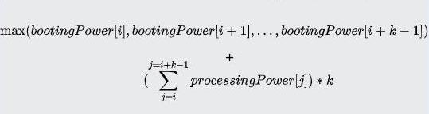
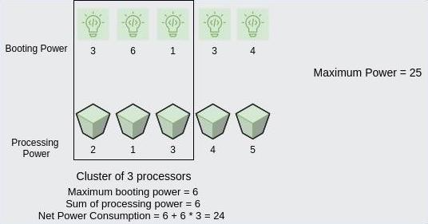

# [Amazon](https://www.amazon.com)

[](https://github.com/NickolasHKraus/amazon/blob/master/LICENSE)

Solutions for the code assessment and technical interview

## Online Technical Assessment

### Coding Assessment Demo

#### Problem 1

What is the difference between `<span>` and `<div>`?

**Solution**

The `<span>` HTML tag is an inline container, whereas the `<div>` HTML tag defines a division or block in an HTML document.

#### Problem 2

For each multiple of 3, print "Fizz" instead of the number. For each multiple of 5, print "Buzz" instead of the number. For numbers which are multiples of both 3 and 5, print "FizzBuzz" instead of the number.

**Solution**

See `fizz_buzz.go`.

### Coding Assessment

**Overview**
* You will have 105 minutes to complete 2 coding challenges and coding approach.
* There will be 2 surveys following the assessment; a work style survey (15 min) and feedback survey (5 min).
* You will have the option of coding in C, C++, C++14, C#, Go, Java7, Java8, Javascript, Kotlin, Objective-C, PyPy2, PyPy3, Python 2, Python 3, Ruby, Scala, and Swift.
* Efficiency and optimization, as opposed to brute force solutions, earn more points.
* Your code must compile for all code questions in order to move forward in the interview process.
* Be sure to test your code and ensure it runs before you submit your code or before time runs out.
* Ensure your solutions consider all edge cases and handle large inputs effectively. This is key to doing well in the assessment.

**Data Structures**
* Understand the inner workings of common data structures and be able to compare and contrast their usage in various applications. Know the runtimes for common operations as well as how they use memory.

**Algorithms**
* Basic implementation strategies of different classes of algorithms is more important than memorizing the specific details of any given algorithm.
* Consider reviewing traversals and divide and conquer algorithms.
* Consider knowing how and when to use a breadth-first search vs. a depth-first search, and what the trade-offs are.

**Coding**
* Be comfortable coding by hand.

**Object-Oriented Design**
* Have a working knowledge of a few common and useful design patterns.
* Know the appropriate use of inheritance and aggregation.

**Databases**
* The more you know about how relational and non-relational databases work and what trade-offs exist between them, the better prepared you will be.

### Coding Assessment

#### Problem 1

Imagine you are shopping on Amazon.com for some good weight lifting equipment. The equipment you want has plates of many different weights that you can combine to lift.

The listing on Amazon gives you an array, `plates`, that consists of `n` different weighted plates, in kilograms. There are no two plates with the same weight. The element `plates[i]` denotes the weight of the `i`<sup>th</sup> plate from the top of the stack. You consider weight lifting equipment to be good if the plate at the top is the lightest, and the plate at the bottom is the heaviest.

More formally, the equipment with array `plates` will be called good weight lifting equipment if it satisfies the following conditions (assuming the index of the array starts from 1):
* `plates[1] < plates[i]` for all (`2 ≤ i ≤ n`)
* `plates[i] < plates[n]` for all (`1 ≤ i ≤ n−1`)

In one move, you can swap the order of adjacent plates. Find out the minimum number of moves required to form good weight lifting equipment.

**Example**

Let the plates be in the order:

```
plates = [3, 2, 1]
```

In the first move, we swap the first and the second plates. After swapping, the order becomes:

```
plates = [2, 3, 1]
```

In the second move, we swap the second and the third plates. After swapping, the order becomes:

```
plates = [2, 1, 3]
```

In the third move, we swap the first and the second plates. After swapping, the order becomes:

```
plates = [1, 2, 3]
```

Now, the array satisfies the condition after 3 moves.

**Function Description**

Complete the function `getMinMoves` in the editor below.

`getMinMoves` has the following parameter:
* `int plates[n]`: the distinct weights

*Returns*
* `int`: the minimum number of operations required

**Constraints**
* `2 ≤ n ≤ 10^5`
* `1 ≤ plates[i] ≤ 10^9` for all (`1 ≤ i ≤ n`)
* `plates` consists of distinct integers.

#### Problem 2

Amazon Web Services (AWS) has several data centers which have multiple processors that perform computations. In one such data center, these processors are placed in a sequence *with their IDs denoted by 1,2,…,n*. Each processor consumes a certain amount of power to boot up, denoted by `bootingPower[i]`. After booting, a processor uses `processingPower[i]` of power to run the processes. For maximum utilization, the data center wishes to group these processors into clusters. Clusters can only be formed of processors located adjacent to each other. For example, processors 2, 3, 4, 5 can form a cluster, but 1, 3, 4 cannot.

The net power consumption of a cluster of `k` processors (`i`,`i+1`,…,`i+k−1`) is defined as:

<p align="center">
  
</p>

That is, *net power consumption* = *maximum booting power* among the `k` processors + (*sum of processing power of processors*) * `k`.

A cluster of processors is said to be *sustainable* if its *net power consumption* does not exceed a given threshold value `powerMax`.

Given the booting power consumption and the processing power consumption of `n` processors denoted by `bootingPower` and `processingPower` respectively, and the threshold value `powerMax`, find the maximum possible number of processors which can be grouped together to form a *sustainable* cluster. If no such clusters can be formed, return 0.

Here,
* Maximum booting power = max(3, 6, 1) = 6
* Sum of processing powers = 2 + 1 + 3 = 6
* Thus, net power consumption = 6 + 6 * 3 = 24 ≤ powerMax

Thus, we can group `k=3` processors to form a *sustainable* cluster. Note that the minimum power consumption to form a cluster of `k=4` processors is 46, by forming a cluster of the first 4 processors. Since this cost is greater than the threshold, we cannot form a cluster with 4 processors. The maximum possible cluster size is 3.

**Function Description**

Complete the function `findMaximumSustainableClusterSize` in the editor below.

`findMaximumSustainableClusterSize` has the following parameters:
* `int processingPower[n]`: the power consumption of each processor in running the processes
* `int bootingPower[n]`: the power consumption of each processor in bootup
* `long_int powerMax`: the threshold power consumption

*Returns*
* `int`: the maximum cluster size which is *sustainable*, if no cluster exists, return 0.

**Constraints**
* `1 ≤ n ≤ 10^5`
* `1 ≤ powerMax ≤ 10^14`

**Note**: It is not mandatory for **all** clusters of size `k` to be *sustainable*. Even one such cluster is sufficient.

**Example**

```
bootingPower = [3, 6, 1, 3, 4]
processing Power = [2, 1, 3, 4, 5]
powerMax = 25
```

If `k=2`, any adjacent pair can be chosen. The highest usage is the pair `[4,5]` with net power consumption 4+(4+5)*2=22. Next, try `k=3`. Group the first 3 processors together as:

```
Maximum Power = 25
Cluster of 3 processors
Maximum booting power = 6
Sum of processing power = 6
Net Power Consumption = 6 + 6 * 3 = 24
```

<p align="center">
  
</p>
